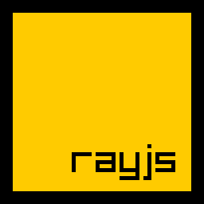

# rayjs - Javascript Bindings for Raylib
Javascript bindings for raylib in a single ~3mb executable

## What is this?
rayjs is small ES2020 compliant Javascript interpreter based on [QuickJS](https://bellard.org/quickjs/) with bindings for [Raylib](https://www.raylib.com/). You can use it to develop desktop games with Javascript.

## Features
* Compiles into a single, small executable without any dependencies for easy distribution
* Use modern Javascript features like classes or async/await
* In-depth auto-complete with definitions for the whole API

## Getting started
1. Download the binary for your platform from the release section.
2. Unzip the executable to a folder and create a new text file in the same folder. Rename the file to `main.js`
3. Open the file with a text-editor (e.g. Notepad) and add the following code
    ```javascript
    const screenWidth = 800;
    const screenHeight = 450;

    initWindow(screenWidth, screenHeight, "raylib [core] example - basic window");

    setTargetFPS(60);   
    while (!windowShouldClose()) {
        beginDrawing();

            clearBackground(RAYWHITE);

            drawText("Congrats! You created your first window!", 190, 200, 20, LIGHTGRAY);

        endDrawing();
    }
    closeWindow();
    ```
4. Run the `rayjs` executable
5. Congratulations, you have created your first rayjs app. 

## Running code
rayjs will run code in three different modes
1. If no parameter is given it will look for a file called `main.js` in the executable directory
2. It will run a given Javascript file given as a command line argument like this `rayjs <filename>`
3. It will look for a file called `main.js` in a folder given as a command line argument like this `rayjs <foldername>`

The directory of the main Javascript module will also be the working directory of the app. Modules and resources will be loaded relative to it.

## Building
Here are some basic steps if you want to compile rayjs yourself:

### Check out required files
```bash
git clone https://github.com/mode777/rayjs.git
git submodule update --init --recursive
```

### Build with cmake
Make sure you have cmake installed and in your path.
```bash
cd rayjs
mkdir build
cd build
cmake ..
make
```

## Performance
QuickJS is one of the [faster JS interpreters](https://bellard.org/quickjs/bench.html). I'm getting about 13000 bunnys in bunnmark before dropping any frames on my 2020 Macbook Air M1 which seems pretty good.
 