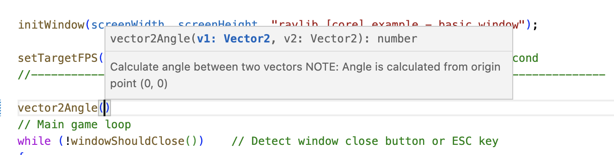

# rayjs - Javascript Bindings for Raylib
Javascript bindings for raylib in a single ~3mb executable

## What is this?
rayjs is small ES2020 compliant Javascript interpreter based on [QuickJS](https://bellard.org/quickjs/) with bindings for [Raylib](https://www.raylib.com/). You can use it to develop desktop games with Javascript.

## What this is not
rayjs is not a binding for NodeJS nor is it running in the browser (yet). It's comes with its own Javascript engine (QuickJS) similar to how NodeJS comes with the V8 engine. That makes it much easier to run and distribute rayjs programs as all you need to run a program / game is the small rayjs executable. No installation, no dlls or additional files are needed.

## Features
* Compiles into a single, small executable without any dependencies for easy distribution
* Use modern Javascript features like classes or async/await
* In-depth auto-complete with definitions for the whole API

## Getting started
1. Download the binary for your platform from the release section.
2. Unzip the executable to a folder and create a new text file in the same folder. Rename the file to `main.js`
3. Open the file with a text-editor (e.g. Notepad) and add the following code
    ```javascript
    const screenWidth = 800;
    const screenHeight = 450;

    initWindow(screenWidth, screenHeight, "raylib [core] example - basic window");

    setTargetFPS(60);   
    while (!windowShouldClose()) {
        beginDrawing();

            clearBackground(RAYWHITE);

            drawText("Congrats! You created your first window!", 190, 200, 20, LIGHTGRAY);

        endDrawing();
    }
    closeWindow();
    ```
4. Run the `rayjs` executable
5. Congratulations, you have created your first rayjs app. 

## Running code
rayjs will run code in three different modes
1. If no parameter is given it will look for a file called `main.js` in the executable directory
2. It will run a given Javascript file given as a command line argument like this `rayjs <filename>`
3. It will look for a file called `main.js` in a folder given as a command line argument like this `rayjs <foldername>`

The directory of the main Javascript module will also be the working directory of the app. Modules and resources will be loaded relative to it.

## API support

The following raylib APIs are supported so far (with a few exceptions):

- core (no VR support yet)
- shapes
- textures
- text (no support for GlyphInfo yet)
- models
- shaders
- audio
- raymath

Similar to including a header in C and for your convenience, all types/functions are provided globally. They are additionally available in a module called 'raylib'

## Auto-Complete / Intellisense

rayjs comes with full auto-complete support in the form of the definitions file `lib.raylib.d.ts`. These will work with Typescript and Javascript. In order to use them with Javascript you should create a Typescript configuration file in the project root (even if you are not using Typescript) called `tsconfig.json` with the following configuration
```json
{
  "compilerOptions": {
    "allowJs": true,
    "target": "es2020",
    "lib": [
      "ES2020"
    ]
  }
}
``` 


## Building
Here are some basic steps if you want to compile rayjs yourself.
You should use CMake for building. **Please note that QuickJS needs Mingw in order to compile correctly on Windows**

### Check out required files
```bash
git clone https://github.com/mode777/rayjs.git
git submodule update --init --recursive
```


### Build with cmake
Make sure you have cmake installed and in your path.
```bash
cd rayjs
mkdir build
cd build
cmake ..
make
```

## Performance
QuickJS is one of the [faster JS interpreters](https://bellard.org/quickjs/bench.html). I'm getting about 13000 bunnys in the unmodified bunnmark before dropping any frames on my 2020 Macbook Air M1 which seems pretty good.
 
